# XEUR.AI Visualizations & Benefits Analysis

This document provides visual representations of XEUR.AI's key benefits, market positioning, and strategic advantages. These visualizations demonstrate the transformative potential of our technology and the value it creates for stakeholders.

## The Extinction Event: Disruptive Impact Metrics

XEUR.AI represents an extinction-level event for traditional game development, fundamentally changing who can create games, how quickly they can be produced, and the economics of the entire industry.

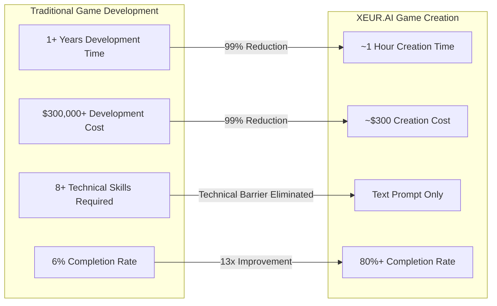

## Force Multiplier Analysis

| Metric | Before XEUR.AI | With XEUR.AI | Force Multiplier |
|--------|----------------|--------------|------------------|
| **Development Time** | 1+ Years | ~1 Hour | >8,700x |
| **Development Cost** | $300,000+ | ~$300 | >1,000x |
| **Technical Barrier** | 8+ Skills Required | Text Prompt | Immeasurable |
| **Market Access** | 28M Developers | 590M+ Creators | 21x |
| **Completion Rate** | 6% Industry Average | >80% Target | >13x |
| **Iteration Speed** | Weeks/Months | Minutes/Hours | >100x |

## Market Opportunity Visualization

The total addressable market (TAM) for XEUR.AI spans multiple segments with significant growth potential:

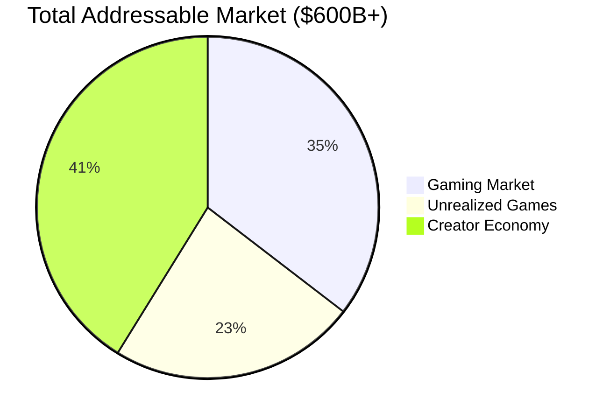

## User Journey Transformation

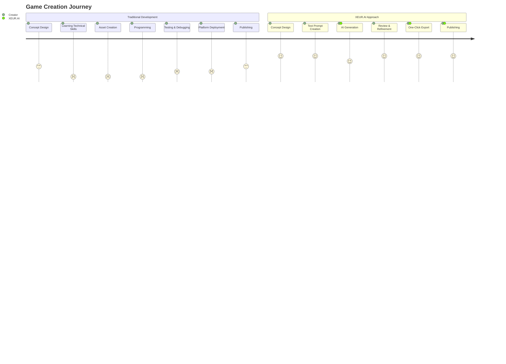

## Revenue Stream Distribution

XEUR.AI's multi-stream revenue model creates diversified, sustainable growth:

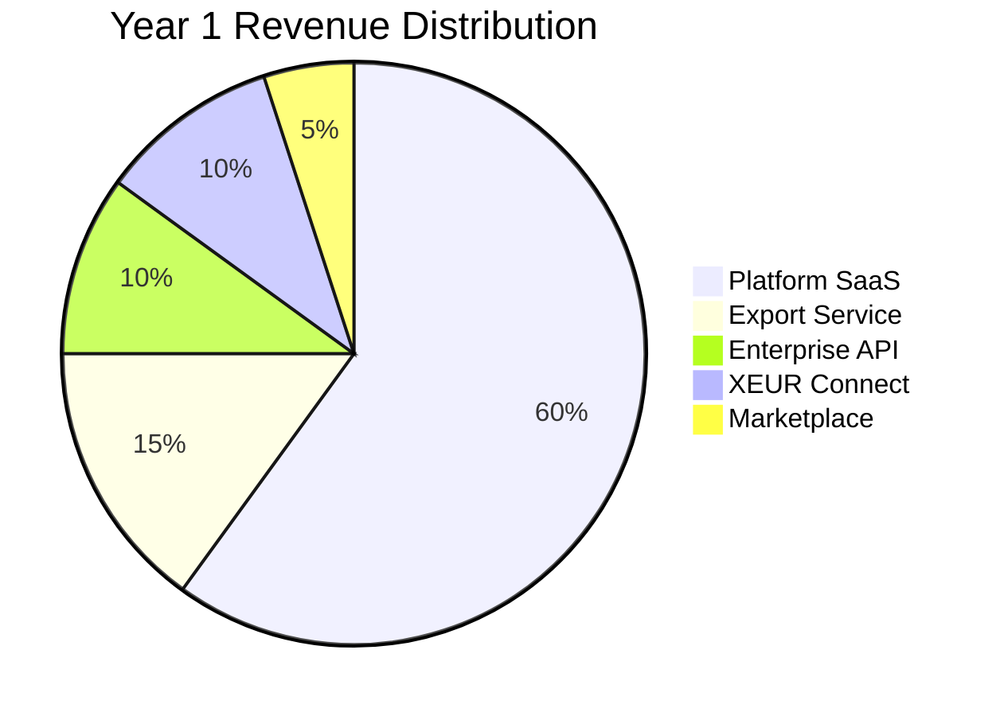

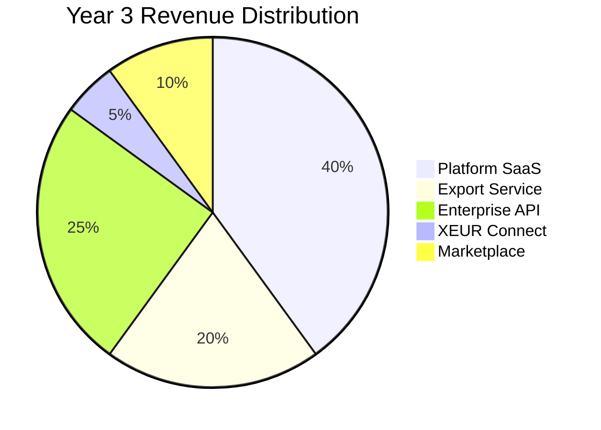

## User Growth Projection

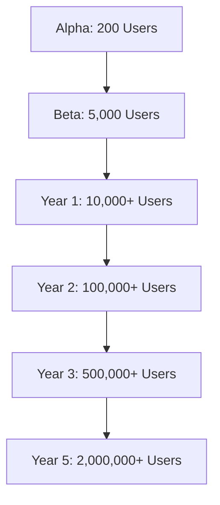

## The XEUR.AI Technology Stack

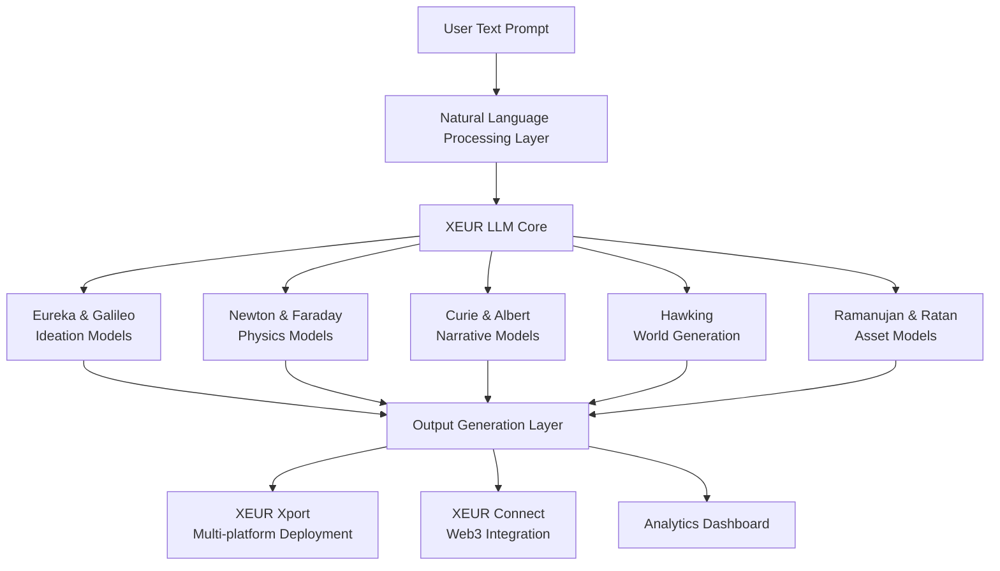

## Multi-Platform Export Capabilities

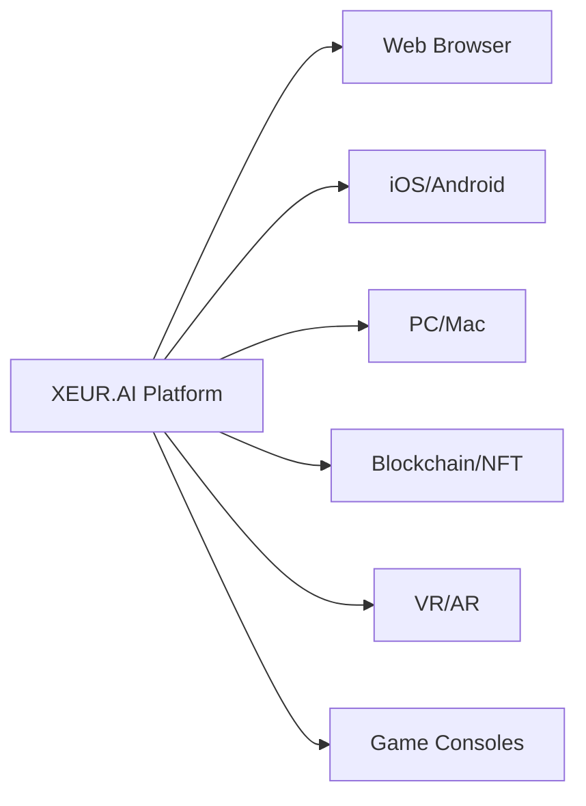

## Benefits by User Persona

### Aspiring Creators (590M+ potential users)

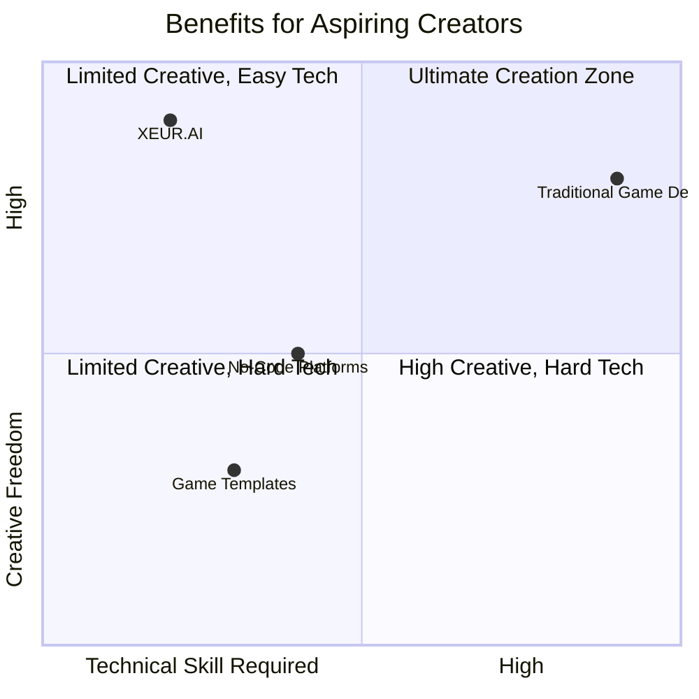

### Professional Game Developers

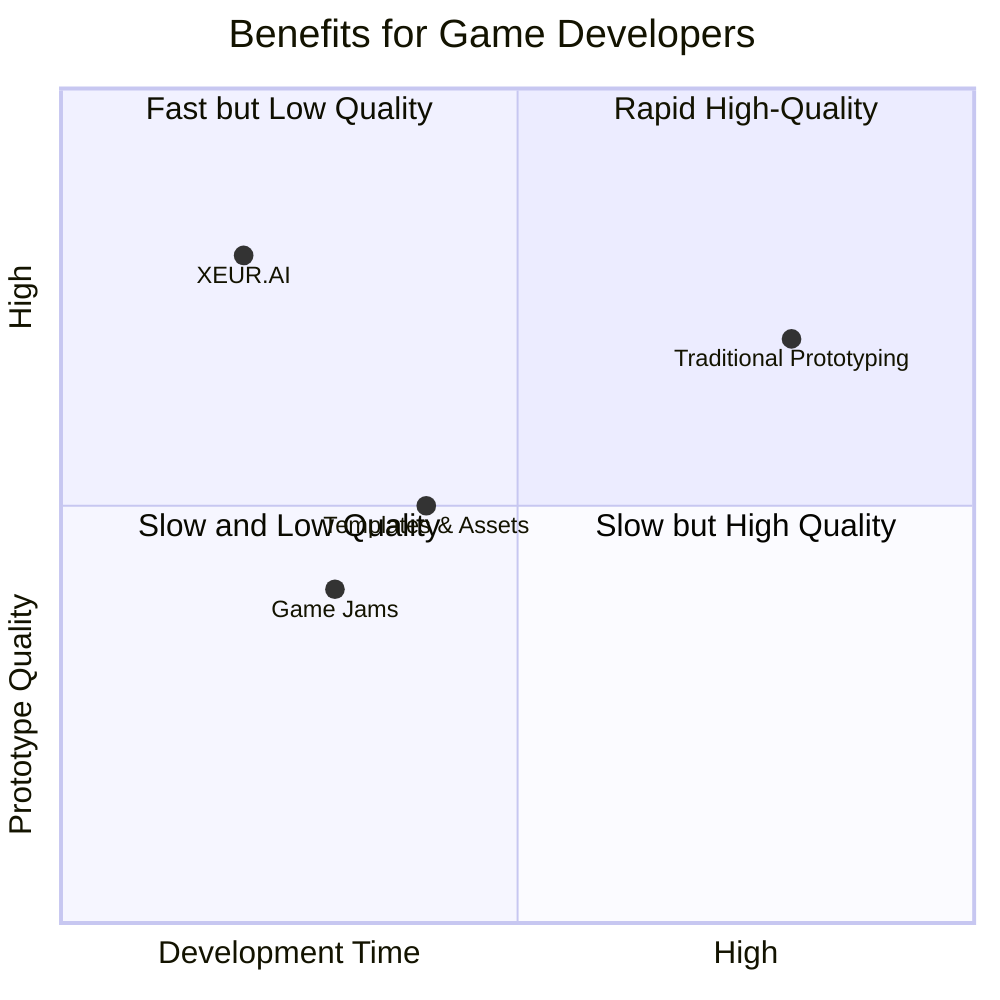

## Financial Projections

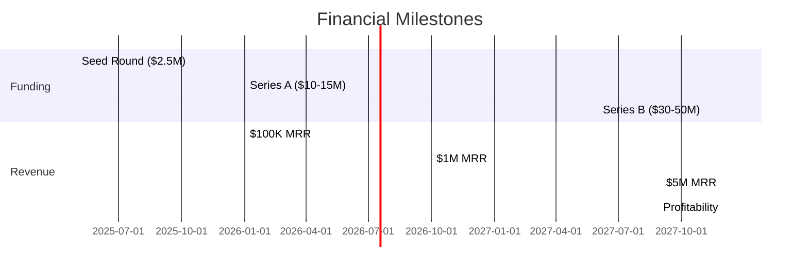

## Competitive Position Matrix

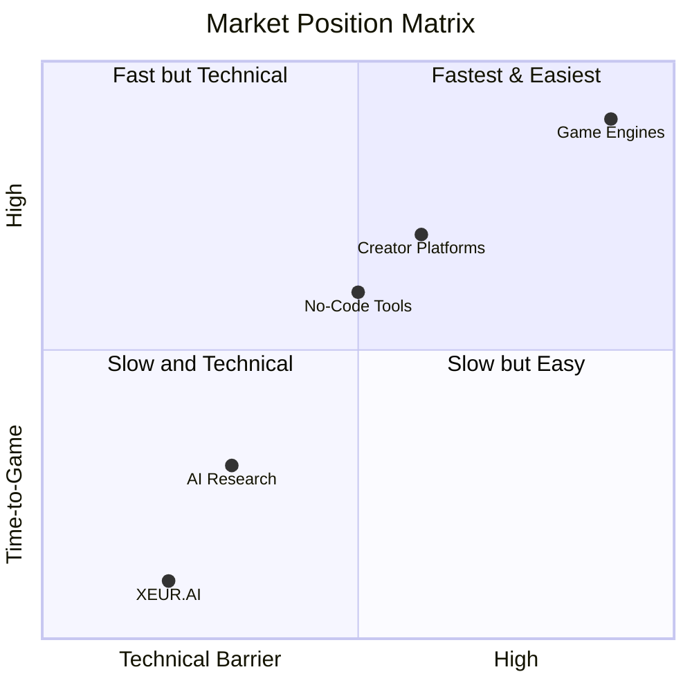

## Strategic Moat Strength Assessment

```mermaid
radar
    title Defensive Moat Strength Assessment
    Technology: 9
    Data: 8
    Team: 8
    IP: 7
    Ecosystem: 6
    Brand: 5
```

## NVIDIA Inception Benefits Value Breakdown

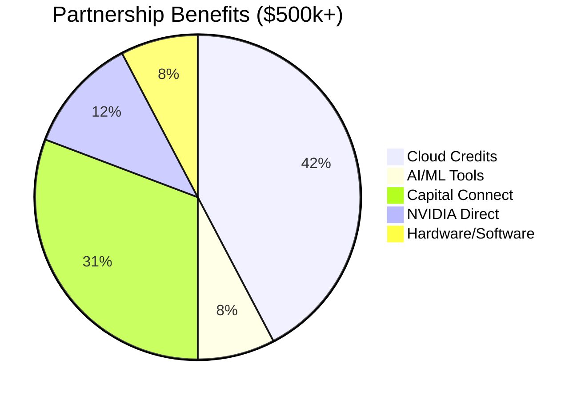

## Implementation Roadmap Phase Priorities

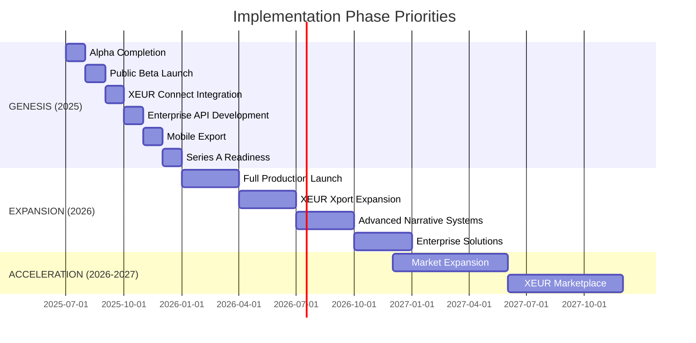

## Game Completion Efficiency - Comparative Analysis

```mermaid
xychart-beta
    title Completed Games vs Attempted Games (%)
    x-axis [Traditional, No-Code Platforms, Creator Platforms, AI Research, XEUR.AI]
    y-axis "Completion Rate (%)" 0 --> 100
    bar [6, 25, 40, 15, 80]
```

---

*These visualizations represent current projections and analyses as of May 2025 and are subject to refinement as market conditions evolve.*